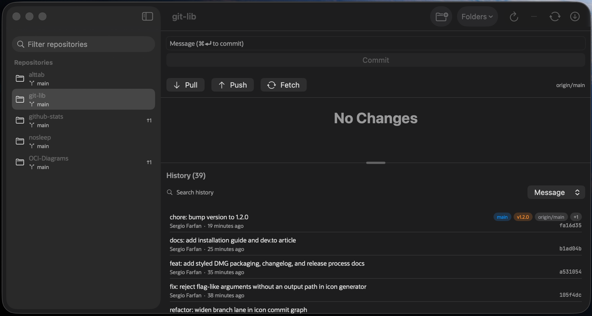

<p align="center">
  
  
  
  
  
</p>

# RepoDeck

**Native macOS dashboard for the git status of all your local repositories.**

<p align="center">
  
</p>

Track a few dozen local git repositories and one question gets hard to answer at a glance: which ones have uncommitted work, and which ones are behind their remote and need a pull? Finding out normally means opening each folder, one at a time, just to check. RepoDeck answers it for every tracked repo at once, in a single native window that stays current as files change on disk — no manual refresh, no per-repo client to open.

> **Latest — 1.7.0:** stage and unstage individual hunks straight from the diff view. The 1.3–1.7 series also added per-repo auto-fetch, repo groups, a ⌘K command palette, auto-rebase on rejected pushes, undo for pulls, stash support, GitHub PR/CI badges, a menu-bar mode, and an in-window command runner — see [Releases & Roadmap](#releases--roadmap).

## Download

**[Download the latest RepoDeck.dmg →](https://github.com/sergio-farfan/repodeck/releases/latest)**

Open the `.dmg` and drag **RepoDeck** to **Applications**.

<!-- UNSIGNED-NOTE: remove this block once notarized builds ship. -->
> This build is ad-hoc signed (not notarized). On first launch, right-click **RepoDeck.app → Open**, or run `xattr -dr com.apple.quarantine /Applications/RepoDeck.app`.

Prefer to build it yourself? See [Build from source](#build-from-source).

## Why RepoDeck?

**One dashboard instead of one client per repo.** Opening an editor, or a separate git GUI, for each repository just to check its status doesn't scale past a handful of projects. RepoDeck tracks any number of folders, recursively finds every git repository underneath them, and shows all of their statuses — dirty or clean, ahead or behind — in a single sidebar.

**Live, not polled.** RepoDeck doesn't run a timer that periodically shells out to `git status` across every repo. It wraps the FSEvents API directly and refreshes a repo's status the moment something changes on disk, with a short debounce so a burst of file writes collapses into one refresh — no timer hammering your disk.

**Native and lightweight.** The UI is SwiftUI on AppKit, the whole app bundle is roughly 2 MB, and there are zero third-party dependencies — no Electron, no bundled runtime.

**Plays nice with your real git.** RepoDeck shells out to the system `git` binary for every operation instead of linking a git library. That's slower per call, but every command inherits your actual `~/.gitconfig` — credential helpers, aliases, hooks, SSH config — exactly as if you'd typed it yourself.

## Features

- **Folder tracking with recursive repo discovery** — track any number of folders; RepoDeck walks each one recursively (up to 8 levels deep) and finds every git repository underneath, skipping `node_modules`, `Pods`, `DerivedData`, and other noisy directories.
- **Live FSEvents status** — sidebar badges, ahead/behind counts, and the uncommitted-changes indicator update the moment something changes on disk, with no polling.
- **Stage, commit, pull, push, fetch** — stage or unstage individual files, "Stage All", commit with ⌘⏎, and pull/push/fetch the selected repo from the buttons under the commit box.
- **Bulk Fetch All / Pull All** — fetch or pull every tracked repo at once, with a toolbar progress readout and a dismissible summary of any that failed.
- **Diff view with hunk staging** — right-click a changed file or a commit in History and choose **View Diff**: a unified diff opens in a side inspector with per-file headers (renames as `old → new`), hunk headers, an old/new line-number gutter, and tinted additions and deletions. Binary files are labeled, conflicted files prompt you to resolve first, and very large diffs are capped rather than hanging. Each hunk header carries a stage (+) or unstage (−) button, so you can stage exactly one hunk of a file — or pull one back out of the index — straight from the diff; commit diffs are read-only.
- **Auto-rebase on rejected push (per repo)** — right-click a repo and enable **Auto-Rebase on Rejected Push**: when a push is rejected because the remote has new commits, RepoDeck runs `git pull --rebase --autostash` and retries the push once, then shows a dismissible notice. A conflicting rebase aborts cleanly back to the pre-rebase state. Off by default for every repo.
- **Per-repo auto-fetch** — set a fetch interval (5/15/30/60 minutes) per repo in Repository Settings; RepoDeck fetches quietly in the background and keeps ahead/behind counts current. Background fetches never raise an error banner — going offline stays quiet — and run in a capped background lane, so they never delay anything you do yourself; your own pulls, pushes, and fetches always jump the queue.
- **Repo groups** — organize repos into named sidebar sections, assigned from Repository Settings or right-click → **Move to Group**. Pinned repos always stay in the Pinned section, so a group's section appears once it has at least one unpinned member.
- **Command palette** — press ⌘K to jump to any repo or run a common action (Fetch All, Pull All, Refresh Repositories, or the selected repo's Pull/Push/Fetch/Reveal in Finder/Open in Terminal) from the keyboard, with matches ranked prefix > word-boundary > substring.
- **In-window command runner** — right-click a repo → **Open Command Runner** (or the terminal button in the sync bar) to dock a resizable command pane under the detail view. Commands run via your login shell in the repo's directory, streaming output live in the app's monospace font and theme; ⏎/**Run** executes, **Stop** cancels, ↑/↓ recall history, and each repo keeps its own scrollback. It is deliberately not a terminal emulator — commands run to completion without a TTY (no `vim`/`htop`, and **Stop** terminates the shell rather than processes it already spawned) and ANSI colors are stripped to plain text. **Open in Terminal** still opens Terminal.app when you want a real terminal.
- **Undo for pull and auto-rebase push** — before every pull and before an auto-rebase push's rebase-and-retry, RepoDeck records HEAD as a `refs/repodeck/undo/*` ref (surviving restarts and `git gc`). An Undo button in the sync bar restores it with `git reset --keep`, preserving uncommitted work and refusing rather than clobbering local edits; it declines cleanly if the repo has moved on since. One level, per repo — remote state is never touched.
- **Stash support** — a Stashes section at the bottom of the Changes list lists each stash with its date; right-click to Apply, Pop, or Drop (Drop confirms first). A Stash button stashes all current changes, untracked files included.
- **GitHub PR/CI badges** — with the GitHub CLI (`gh`) installed and signed in, the sync bar shows the current branch's open pull request and a CI status dot (green/red/amber/hollow), click-through to the PR. Read-only and refreshed at most every five minutes; entirely invisible when `gh` isn't available. `gh` is optional — everything else works without it.
- **Menu-bar mode** — an optional menu-bar panel (Settings ▸ General) with a repo summary, your pinned and dirtiest repos, and Fetch All / Pull All; click a repo to jump to it in the main window. Off by default.
- **Repository Settings sheet** — right-click a repo → **Repository Settings…** to set auto-rebase, auto-fetch interval, and group assignment together in one place; changes apply immediately.
- **Sidebar filter + pinning** — filter the list by repo name or branch, and pin the repos you touch most often into their own section above the rest, alongside any named groups you've set up.
- **History search** by commit message, author, file path, or content (git's pickaxe search) — scoped per repo, updating as you type.
- **Resizable Changes/History split** — drag the divider to give more vertical room to whichever pane you're using.
- **Themes** (System/Light/Dark), custom accent color, fonts, and font size (⌘,) — a Settings window covers appearance, accent color, UI and monospace font family, and base text size.

## Usage

Add one or more folders — from the toolbar's **Add Folder…** button, or the empty-state prompt on first launch — and RepoDeck recursively discovers every git repository underneath them and lists them in the sidebar, sorted alphabetically, with pinned repos in a section of their own above the rest, followed by one section per group you've created, then the remaining ungrouped repos. Selecting a repo shows its status: a **Changes** pane (merge conflicts, staged, unstaged, and untracked files, each in its own section) and, below it, a searchable **History** pane. Drag the divider between the two to resize them.

Stage a file from its row, or use **Stage All**; type a commit message and either click **Commit** or press ⌘⏎ while the message field has focus. **Pull**, **Push**, and **Fetch** for the selected repo sit in a row under the commit box, next to an ahead/behind readout and the current upstream. **Fetch All** and **Pull All**, in the toolbar, do the same across every tracked repo at once; a progress bar tracks how many are done, and a dismissible banner reports how many failed. Right-click a changed file — or a commit in the History pane — and choose **View Diff** to inspect the change as a unified diff in a side inspector — hunks in a working-file diff can be staged or unstaged individually via the button on each hunk header; it closes with its ✕ button and clears when you switch repos. Right-click a repo and choose **Open Command Runner** (or click the terminal button in the sync bar) to dock a command pane under the detail view and run shell commands in that repo's directory.

Each sidebar row carries a change-count badge and, when applicable, an ahead/behind readout (↑/↓). A small orange dot next to the branch name flags uncommitted changes sitting on `main` or `master` specifically — a repo you probably don't want to leave dirty. Right-click any repo for Pin/Unpin, the per-repo Auto-Rebase on Rejected Push toggle, Repository Settings… (auto-rebase, auto-fetch, and group in one sheet), Move to Group, Reveal in Finder, Open in Terminal, Open in VS Code (shown only if it's installed), Copy Path, or, for a repo that's vanished from disk, Remove.

The History search field matches against whichever scope is selected — Message, Author, File, or Content (git's pickaxe search) — and updates as you type.

| Shortcut | Action |
|----------|--------|
| <kbd>⌘</kbd><kbd>⏎</kbd> | Commit, while the message field has focus |
| <kbd>⌘</kbd><kbd>R</kbd> | Refresh — rescan all tracked folders |
| <kbd>⌘</kbd><kbd>,</kbd> | Open Settings — appearance, accent color, fonts, size |
| <kbd>⌘</kbd><kbd>K</kbd> | Command Palette |

## Releases & Roadmap

Full details per release live in the [CHANGELOG](CHANGELOG.md); installers are on the [releases page](https://github.com/sergio-farfan/repodeck/releases).

| Version | Date | Highlights |
|---------|------|------------|
| [1.7.0](https://github.com/sergio-farfan/repodeck/releases/tag/v1.7.0) | 2026-07-15 | Hunk staging from the diff view — stage or unstage one hunk at a time |
| [1.6.0](https://github.com/sergio-farfan/repodeck/releases/tag/v1.6.0) | 2026-07-15 | In-window command runner (login shell per repo, live output, history) |
| [1.5.0](https://github.com/sergio-farfan/repodeck/releases/tag/v1.5.0) | 2026-07-14 | Diff view — unified diffs for files and commits in a side inspector |
| [1.4.0](https://github.com/sergio-farfan/repodeck/releases/tag/v1.4.0) | 2026-07-14 | Undo for pull/auto-rebase, stash support, GitHub PR/CI badges, menu-bar mode |
| [1.3.0](https://github.com/sergio-farfan/repodeck/releases/tag/v1.3.0) | 2026-07-14 | Repository Settings, per-repo auto-fetch, repo groups, ⌘K palette, auto-rebase on rejected push, network timeouts |
| [1.2.0](https://github.com/sergio-farfan/repodeck/releases/tag/v1.2.0) | 2026-07-08 | Styled DMG installer, GitHub Releases distribution, redesigned icon |
| [1.1.0](https://github.com/sergio-farfan/repodeck/releases/tag/v1.1.0) | 2026-07-08 | Themes + Settings window, draggable split, history search, app icon |
| [1.0.0](https://github.com/sergio-farfan/repodeck/releases/tag/v1.0.0) | 2026-07-08 | Multi-repo dashboard: discovery, live status, stage/commit/sync, bulk fetch/pull |

### Planned

Unordered and undated — priorities shift with real-world use:

- **Notarized builds** — remove the right-click-to-open step on first launch.
- **File-mode fidelity for hunk staging** — carrying executable bits through diffs, so unstaging a staged delete of an executable leaves no residual mode change.
- **PR review state on the badge** — surface approved / changes-requested next to the CI dot (already parsed, not yet shown).
- **Command runner process groups** — make **Stop** also terminate child processes the shell already spawned.

## Build from source

RepoDeck is Swift Package Manager only — there's no `.xcodeproj`, just `Package.swift`.

```bash
git clone git@github.com:sergio-farfan/repodeck.git
cd repodeck
swift build            # compile
swift test             # run the test suite (231 tests)
swift run RepoDeck     # run in dev mode
Scripts/bundle.sh --open   # build and launch the .app bundle (dist/RepoDeck.app)
Scripts/make-dmg.sh        # package the installer DMG (--release publishes a GitHub Release)
```

### Prerequisites

| Requirement | Details |
|-------------|---------|
| **macOS** | 15+ |
| **Xcode / Swift** | Xcode 26, or a Swift 6.1+ toolchain |
| **git** | at `/usr/bin/git` |

## How It Works

Status parsing runs on `git status --porcelain=v2 --branch --untracked-files=all -z`, invoked with `GIT_OPTIONAL_LOCKS=0` so a concurrent git process never blocks it. `PorcelainParser` is a pure function over the raw output — no `Process`, no I/O — so it's unit-tested directly. Porcelain v2's ordinary-change records carry a two-letter `XY` code (index status, worktree status); a file that's staged *and* has further unstaged edits fans out into two rows, one per side of `XY` that isn't a dot. Rename and copy records spend two NUL-delimited tokens on one logical change (the record, then the original path); untracked files are a bare path; unmerged conflicts get their own area rather than going through the staged/unstaged split.

Filesystem watching wraps the FSEvents C API directly rather than polling. Incoming paths are filtered before anything reaches the app — `.git/index.lock` churn (git rewrites it on every `add`/`commit`, which would otherwise make RepoDeck refresh in response to its own git calls), plus `node_modules`, `.build`, and similar noise. A burst of events for the same repo collapses into a single emission 300ms after the last event in the burst — cancel-and-reschedule, not a recurring timer.

Every git invocation funnels through one function, which drains stdout and stderr concurrently while the process is still running (avoiding a pipe-buffer deadlock on large output), enforces a per-call output cap (4 MB by default for `status`, past which the child is sent `SIGTERM` and the partial read comes back flagged as truncated), and acquires a slot from a process-wide, 6-slot counting semaphore before launching — so Fetch All / Pull All firing dozens of git processes at once never overwhelms the machine. That semaphore is two-tier: background work (auto-fetch, PR/CI polling) can hold at most 4 of the 6 slots, and interactive work you triggered jumps ahead of queued background work, so a slow background fetch never delays a push. Network operations also carry a timeout (90s for fetch, 5 min for pull/push) enforced by a `SIGTERM`-then-`SIGKILL` watchdog, so a hung remote can't wedge a slot forever. Cancelling the surrounding Swift task sends `SIGTERM` to the actual child process, not just the awaiting task.

Every one of those subprocesses is the real system `git` binary at `/usr/bin/git` — RepoDeck doesn't link libgit2 or reimplement any git internals. That's slower per call than an in-process library, but it means every operation inherits the user's actual `~/.gitconfig`: credential helpers, aliases, hooks, SSH config, everything, for free. The one exception is the optional PR/CI feature, which shells out to the GitHub CLI (`gh`) — RepoDeck's only non-git subprocess — on the background lane with a 30-second timeout, and shows nothing at all when `gh` isn't installed or signed in.

## Project Structure

```
RepoDeck/
├── Sources/
│   ├── RepoDeckKit/          # No SwiftUI imports — the whole git/parsing/watching engine
│   │   ├── Models/           # Repo, RepoStatus, Commit — plain value types
│   │   ├── Git/              # GitClient, ProcessRunner, PorcelainParser, LogParser, HistorySearch
│   │   ├── Scanner/          # RepoScanner — recursive repo discovery
│   │   ├── Watch/             # RepoWatcher — FSEvents wrapper
│   │   └── Theme/             # ColorHex — hex string <-> Color conversion
│   └── RepoDeck/              # App target: views and view models wired to RepoDeckKit
│       ├── Theme/             # Theme, ThemeSettings — appearance/accent/font state
│       ├── ViewModels/        # AppModel (tracked folders, scanning), RepoViewModel (per-repo state)
│       ├── Views/             # ContentView, plus Sidebar/, Detail/, Settings/, Shared/
│       └── Resources/         # AppIcon.icns
├── Tests/RepoDeckKitTests/    # Unit and integration tests, real temp git repos, no mocks
├── Scripts/                   # bundle.sh, make-dmg.sh, make-icon.swift, make-iconset.sh, changelog-section.sh
├── Support/                   # Info.plist
└── docs/                      # screenshot.png
```

## Uninstall

```bash
rm -rf /Applications/RepoDeck.app
defaults delete com.sergiofarfan.repodeck
```

## License

[MIT](LICENSE) — Sergio Farfan (sergio.farfan@gmail.com)
