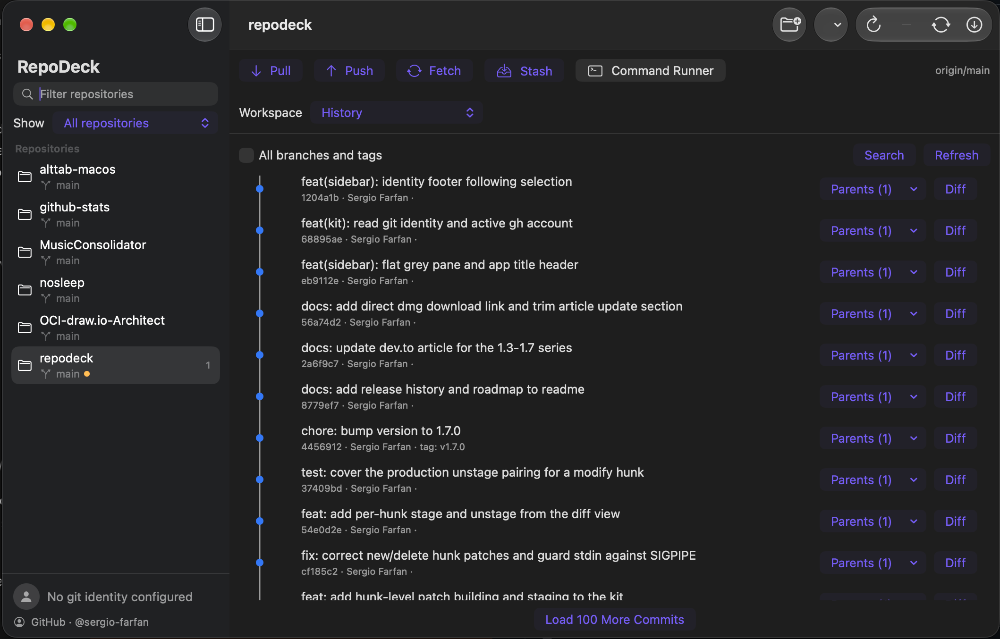

<p align="center">
  
  
  
  
  
</p>

# RepoDeck

**Native macOS Git client with a dashboard for all your local repositories.**

<p align="center">
  
</p>

Track a few dozen local git repositories and one question gets hard to answer at a glance: which ones have uncommitted work, and which ones are behind their remote and need a pull? Finding out normally means opening each folder, one at a time, just to check. RepoDeck answers it for every tracked repo at once, in a single native window that stays current as files change on disk — no manual refresh, no per-repo client to open.

> **[1.10.1 is the latest stable release](https://github.com/sergio-farfan/repodeck/releases/tag/v1.10.1)**, published September 13, 2026. It includes the combined reliability, Git workflow, and hosting changes plus resource-loading and timeout-diagnostic fixes. See [TESTING.md](TESTING.md) for completed and outstanding validation.

## Download

**[Download RepoDeck.dmg →](https://github.com/sergio-farfan/repodeck/releases/latest/download/RepoDeck.dmg)** (direct download; or browse the [latest release](https://github.com/sergio-farfan/repodeck/releases/latest))

Open the `.dmg` and drag **RepoDeck** to **Applications**.

<!-- UNSIGNED-NOTE: remove this block once notarized builds ship. -->
> RepoDeck releases are **ad-hoc signed and not notarized**. After attempting to open a trusted download and verifying its checksum, you may need **System Settings → Privacy & Security → Open Anyway**. See [Apple's first-launch instructions](https://support.apple.com/en-lamr/102445). Developer ID signing and notarization are optional future improvements, not release requirements.

Prefer to build it yourself? See [Build from source](#build-from-source).

## Why RepoDeck?

**One dashboard instead of one client per repo.** Opening an editor, or a separate git GUI, for each repository just to check its status doesn't scale past a handful of projects. RepoDeck tracks any number of folders, recursively finds every git repository underneath them, and shows all of their statuses — dirty or clean, ahead or behind — in a single sidebar.

**Live, not polled.** RepoDeck doesn't run a timer that periodically shells out to `git status` across every repo. It wraps the FSEvents API directly and refreshes a repo's status the moment something changes on disk, with a short debounce so a burst of file writes collapses into one refresh — no timer hammering your disk.

**Native and lightweight.** The UI is SwiftUI on AppKit, the app has zero third-party dependencies — no Electron, no bundled runtime.

**Plays nice with your real git.** RepoDeck shells out to the system `git` binary for every operation instead of linking a git library. That's slower per call, but every command inherits your actual `~/.gitconfig` — credential helpers, aliases, hooks, SSH config — exactly as if you'd typed it yourself.

## Features

- **Folder tracking and worktree discovery** — track any number of folders; RepoDeck walks each one recursively (up to 8 levels deep), skipping dependency/build folders, then expands Git’s registered worktrees. Linked siblings outside the tracked folder and nested registered worktrees appear separately. Bare repositories are discovery sources for their checkouts, rather than editable working directories.
- **Live FSEvents status** — sidebar badges, ahead/behind counts, and the uncommitted-changes indicator update the moment something changes on disk, with no polling.
- **Stage, commit, pull, push, fetch** — stage or unstage individual files, "Stage All", commit with ⌘⏎, and pull/push/fetch the selected repo from the buttons under the commit box.
- **Bulk Fetch All / Pull All** — fetch or pull every tracked repo at once, with a toolbar progress readout and explicit success, failure, and skipped counts. Busy repositories are reported as skipped.
- **Diff view with hunk staging** — right-click a changed file or a commit in History and choose **View Diff**: a unified diff opens in a side inspector with per-file headers (renames as `old → new`), hunk headers, an old/new line-number gutter, and tinted additions and deletions. Binary files are labeled, conflicted files prompt you to resolve first, and very large diffs are capped rather than hanging. Eligible hunks have Stage or Unstage controls. Non-UTF-8 content, unknown or changed modes, symlinks, submodules, and renames require a whole-file operation with a visible explanation. Displayed hunks are revalidated before writing; commit diffs are read-only.
- **Auto-rebase on rejected push (per repo)** — right-click a repo and enable **Auto-Rebase on Rejected Push**: when a push is rejected because the remote has new commits, RepoDeck runs `git pull --rebase --autostash` and retries the push once, then shows a dismissible notice. If the rebase conflicts, RepoDeck attempts to abort it; conflicts or a retained autostash may still require recovery. Off by default for every repo.
- **Per-repo auto-fetch** — set a fetch interval (5/15/30/60 minutes) per repo in Repository Settings; RepoDeck fetches quietly in the background and keeps ahead/behind counts current. Background fetch failures have a visible status explanation. Fetches use a capped background lane; interactive requests have queue priority, and writes sharing Git metadata are serialized.
- **Repo groups** — organize repos into named sidebar sections, assigned from Repository Settings or right-click → **Move to Group**. Pinned repos always stay in the Pinned section, so a group's section appears once it has at least one unpinned member.
- **Command palette** — press ⌘K to jump to any repo or run a common action (Fetch All, Pull All, Refresh Repositories, or the selected repo's Pull/Push/Fetch/Reveal in Finder/Open in Terminal) from the keyboard, with matches ranked prefix > word-boundary > substring.
- **In-window command runner** — right-click a repo → **Open Command Runner** (or the terminal button in the sync bar) to dock a resizable command pane under the detail view. Commands run via your login shell in the repo's directory, streaming output live in the app's monospace font and theme; ⏎/**Run** executes, **Stop** cancels, ↑/↓ recall history, and each repo keeps its own scrollback. It is deliberately not a terminal emulator — commands run to completion without a TTY (no `vim`/`htop`; background child processes belong to the command and stop with it) and ANSI colors are stripped to plain text. Output is bounded and an exceeded limit is reported explicitly. **Open in Terminal** opens your configured terminal application when you need a real terminal.
- **Undo for pull and auto-rebase push** — before every pull and before an auto-rebase push's rebase-and-retry, RepoDeck records HEAD as a `refs/repodeck/undo/*` ref (surviving restarts and `git gc`). An Undo button in the sync bar restores it with `git reset --keep`, preserving uncommitted work and refusing rather than clobbering local edits; it declines cleanly if the repo has moved on since. One level, per repo — remote state is never touched.
- **Stash support** — a Stashes section at the bottom of the Changes list lists each stash with its date; right-click to Apply, Pop, or Drop (Drop confirms first). A Stash button stashes all current changes, untracked files included.
- **GitHub PR/CI badges** — the optional sync-bar badge matches both the source repository/fork and branch, with distinct passing/failing/pending check symbols and browser navigation. The separate Reviews workspace handles detailed hosting operations.
- **GitHub and GitLab Reviews** — select an explicit remote and provider; authentication stays in `gh`/`glab` and is checked for that host/account. Browse paginated open pull/merge requests, descriptions, changed-file patches, discussion, and checks; create a draft or ready request from an already-pushed source branch; mark drafts ready; comment, approve, or merge using a preview of the account, destination branches, and expected head commit. GitHub additionally supports formal change-request reviews. GitLab currently supports comments and approvals; use its browser UI for formal change requests. The merge method is subject to server permissions, protection, and project configuration.
- **Isolated review checkout** — fetch a PR/MR into a new detached worktree after verifying the fetched commit matches the preview. The current checkout and its uncommitted files stay in place. Review selection and drafts survive navigation; unsent text is saved locally. A timed-out write is checked against the server before retrying, with stable operation markers to avoid duplicate creation or comments.
- **Developer tool preferences** — configure Git, `gh`, and `glab` executable paths, choose installed editor/terminal applications, and override applications per repository. Blank optional CLI paths use PATH discovery; files use their macOS default application when no editor is configured. Pane dividers support keyboard/VoiceOver adjustment, and command-palette selection follows keyboard navigation.
- **Menu-bar mode** — an optional menu-bar panel (Settings ▸ General) with a repo summary, your pinned and dirtiest repos, and Fetch All / Pull All; click a repo to jump to it in the main window. Off by default.
- **Repository Settings sheet** — right-click a repo → **Repository Settings…** to set auto-rebase, auto-fetch interval, and group assignment together in one place; changes apply immediately.
- **Sidebar filter + pinning** — filter the list by repo name or branch, and pin the repos you touch most often into their own section above the rest, alongside any named groups you've set up.
- **History search** by commit message, author, file path, or content (git's pickaxe search) — scoped per repo, updating as you type.
- **Commit graph** — parent edges and branch/tag decorations, current/all-branch scopes, 100-commit pagination, parent navigation, diffs, and history search.
- **Branches and worktrees** — create, switch, rename, safely delete merged branches, configure tracking, merge or rebase clean working trees, and create/open/safely remove worktrees. Every write previews its repository and action.
- **Conflict workspace** — base/current/incoming text with an editable result, separate Save and Mark Resolved actions, operation-aware Continue/Abort, and external editor/terminal fallback with explicit whole-file staging. Changed conflict snapshots and stale operation confirmations are rejected.
- **Dashboard attention filters** — show uncommitted changes, conflicts, repositories needing push/pull, or errors. Each worktree retains its selected workspace, drafts, and diff context while navigating.
- **Themes** (System/Light/Dark), custom accent color, fonts, and font size (⌘,) — a Settings window covers appearance, accent color, UI and monospace font family, and base text size.

## Usage

Add one or more folders — from the toolbar's **Add Folder…** button, or the empty-state prompt on first launch — and RepoDeck recursively discovers every git repository underneath them and lists them in the sidebar, sorted alphabetically, with pinned repos in a section of their own above the rest, followed by one section per group you've created, then the remaining ungrouped repos. Select a repository, then choose **Changes**, **History**, **Branches & Worktrees**, **Conflicts**, or **Reviews**. The workspace selector adapts to narrow windows. The optional command pane can be resized with the pointer or keyboard.

Stage a file from its row, or use **Stage All**; type a commit message and either click **Commit** or press ⌘⏎ while the message field has focus. **Pull**, **Push**, and **Fetch** for the selected repo sit in the top action row, next to an ahead/behind readout and the current upstream. **Fetch All** and **Pull All**, in the toolbar, do the same across every tracked repo at once; a progress bar tracks how many are done, and a dismissible banner reports succeeded, failed, and skipped counts. Right-click a changed file — or a commit in the History pane — and choose **View Diff** to inspect the change as a unified diff in a side inspector — hunks in a working-file diff can be staged or unstaged individually via the button on each hunk header; it closes with its ✕ button and retains its selection per worktree when you navigate. Right-click a repo and choose **Open Command Runner** (or click the terminal button in the sync bar) to dock a command pane under the detail view and run shell commands in that repo's directory.

Each sidebar row carries a change-count badge and, when applicable, an ahead/behind readout (↑/↓). A small orange dot next to the branch name flags uncommitted changes sitting on `main` or `master` specifically — a repo you probably don't want to leave dirty. Right-click any repo for Pin/Unpin, the per-repo Auto-Rebase on Rejected Push toggle, Repository Settings… (auto-rebase, auto-fetch, and group in one sheet), Move to Group, Reveal in Finder, Open in Terminal, Open in Editor (your configured application), Copy Path, or, for a repo that's vanished from disk, Remove.

The History search field matches against whichever scope is selected — Message, Author, File, or Content (git's pickaxe search) — and updates as you type.

| Shortcut | Action |
|----------|--------|
| <kbd>⌘</kbd><kbd>⏎</kbd> | Commit, while the message field has focus |
| <kbd>⌘</kbd><kbd>R</kbd> | Refresh — rescan all tracked folders |
| <kbd>⌘</kbd><kbd>,</kbd> | Open Settings — appearance, accent color, fonts, size |
| <kbd>⌘</kbd><kbd>K</kbd> | Command Palette |

## Releases & Roadmap

Full details per release live in the [CHANGELOG](CHANGELOG.md); installers are on the [releases page](https://github.com/sergio-farfan/repodeck/releases).

| Version | Date | Highlights |
|---------|------|------------|
| [1.10.1](https://github.com/sergio-farfan/repodeck/releases/tag/v1.10.1) | 2026-09-13 | Commit graph, branches/worktrees, conflict resolver, GitHub/GitLab reviews, reliability fixes, safer icon loading, and clearer review layout |
| 1.10.0 | Unpublished draft | Superseded by 1.10.1, which includes all of its additions and fixes |
| [1.9.0](https://github.com/sergio-farfan/repodeck/releases/tag/v1.9.0) | 2026-07-20 | Hide and restore repositories; sidebar/footer refinements |
| [1.8.0](https://github.com/sergio-farfan/repodeck/releases/tag/v1.8.0) | 2026-07-20 | Per-repository identity footer and sidebar restyle |
| [1.7.0](https://github.com/sergio-farfan/repodeck/releases/tag/v1.7.0) | 2026-07-15 | Hunk staging from the diff view — stage or unstage one hunk at a time |
| [1.6.0](https://github.com/sergio-farfan/repodeck/releases/tag/v1.6.0) | 2026-07-15 | In-window command runner (login shell per repo, live output, history) |
| [1.5.0](https://github.com/sergio-farfan/repodeck/releases/tag/v1.5.0) | 2026-07-14 | Diff view — unified diffs for files and commits in a side inspector |
| [1.4.0](https://github.com/sergio-farfan/repodeck/releases/tag/v1.4.0) | 2026-07-14 | Undo for pull/auto-rebase, stash support, GitHub PR/CI badges, menu-bar mode |
| [1.3.0](https://github.com/sergio-farfan/repodeck/releases/tag/v1.3.0) | 2026-07-14 | Repository Settings, per-repo auto-fetch, repo groups, ⌘K palette, auto-rebase on rejected push, network timeouts |
| [1.2.0](https://github.com/sergio-farfan/repodeck/releases/tag/v1.2.0) | 2026-07-08 | Styled DMG installer, GitHub Releases distribution, redesigned icon |
| [1.1.0](https://github.com/sergio-farfan/repodeck/releases/tag/v1.1.0) | 2026-07-08 | Themes + Settings window, draggable split, history search, app icon |
| [1.0.0](https://github.com/sergio-farfan/repodeck/releases/tag/v1.0.0) | 2026-07-08 | Multi-repo dashboard: discovery, live status, stage/commit/sync, bulk fetch/pull |

### Planned

Unordered and undated — priorities shift with real-world use:

- **Manual workflow validation** — complete the outstanding live hosting, accessibility, and clean-machine installation/first-launch checks documented for 1.10.1.
- **Optional signing upgrade** — consider Developer ID signing and notarization only if the maintainer later chooses Apple Developer Program membership.
- **Broader workflow coverage** — keep extending fixtures for worktrees, unusual paths, file modes, hooks, and multi-account hosting.
- **PR review state on the badge** — surface approved / changes-requested next to the CI dot (already parsed, not yet shown).
- **Additional hosting services** — evaluate demand beyond GitHub and GitLab without changing ordinary Git support.

### Hosting validation limits

Hosting integration is exercised with fake CLI responses and isolated local Git repositories; live GitHub/GitLab account, permissions, branch-protection, and self-hosted version checks remain part of manual acceptance. Review comments are general review submissions: inline threaded-comment editing is a later milestone. GitHub shows check runs/statuses; GitLab shows the latest pipeline summary. Missing or oversized patches and read failures are explicit and offer a browser link. Credentials are not imported into RepoDeck. Saved review drafts remain local preferences, and duplicate-submission markers are attached as hidden HTML comments to posted descriptions/reviews.

## Build from source

RepoDeck is Swift Package Manager only — there's no `.xcodeproj`, just `Package.swift`.

```bash
git clone https://github.com/sergio-farfan/repodeck.git
cd repodeck
swift build            # compile
swift test             # run all tests
swift run RepoDeck     # run in dev mode
Scripts/bundle.sh --open   # build and launch the .app bundle (dist/RepoDeck.app)
Scripts/make-dmg.sh        # package the installer DMG (--release creates a verified draft)
```

### Prerequisites

| Requirement | Details |
|-------------|---------|
| **macOS** | 15+ |
| **Xcode / Swift** | Swift 6.2+; CI and release baseline: Xcode 26.3 |
| **git** | `/usr/bin/git` by default; configurable in workflow settings |

## How It Works

Status parsing runs on `git status --porcelain=v2 --branch --untracked-files=all -z`, invoked with `GIT_OPTIONAL_LOCKS=0` so a concurrent git process never blocks it. `PorcelainParser` is a pure function over the raw output — no `Process`, no I/O — so it's unit-tested directly. Porcelain v2's ordinary-change records carry a two-letter `XY` code (index status, worktree status); a file that's staged *and* has further unstaged edits fans out into two rows, one per side of `XY` that isn't a dot. Rename and copy records spend two NUL-delimited tokens on one logical change (the record, then the original path); untracked files are a bare path; unmerged conflicts get their own area rather than going through the staged/unstaged split.

Filesystem watching wraps the FSEvents C API directly rather than polling. Events are mapped to known worktrees before discovery exclusions are applied. Source directories named `vendor` or `target` within known repositories remain observable; Git/common directories and discovered sibling worktrees are watched too. Temporary index locks are ignored. A burst of events for the same repo collapses into a single emission 300ms after the last event in the burst — cancel-and-reschedule, not a recurring timer.

Every Git and hosting CLI invocation uses the shared subprocess runner. It creates an owned process group, drains nonblocking output while writing input, bounds combined stdout/stderr, and cancels queued work before launch. Cancellation and timeouts stop the whole command group, with a short SIGTERM-to-SIGKILL grace period. A completed command also cleans up background children; the command pane is not a daemon supervisor.

The process-wide limit is six commands, with at most four background jobs and priority for interactive waiters. Git status/diff calls use explicit output limits; the default for other calls is 16 MiB. Streaming output has a bounded delivery queue and preserves Unicode across pipe chunks. Exceeding a limit is reported rather than silently growing memory.

Git defaults to `/usr/bin/git`, with an explicit override available in workflow settings. It retains the user’s configuration, credential helpers, hooks, and SSH setup. Optional hosting clients use configured GitHub/GitLab CLIs and display authentication or availability problems separately from a successful “no reviews” result. See [architecture](docs/architecture.md) for implementation boundaries.


## Project Structure

```
RepoDeck/
├── Sources/
│   ├── RepoDeckKit/          # No SwiftUI imports — the whole git/parsing/watching engine
│   │   ├── Models/           # Repo, RepoStatus, Commit — plain value types
│   │   ├── Git/              # GitClient, ProcessRunner, PorcelainParser, LogParser, HistorySearch
│   │   ├── Hosting/          # GitHub/GitLab adapters, safe review operations, neutral models
│   │   ├── Scanner/          # RepoScanner — recursive repo discovery
│   │   ├── Watch/             # RepoWatcher — FSEvents wrapper
│   │   └── Theme/             # ColorHex — hex string <-> Color conversion
│   ├── RepoDeckCore/          # Observable app/repo state and background scheduling
│   └── RepoDeck/              # SwiftUI/AppKit views, commands, and native application actions
│       ├── Theme/             # Theme, ThemeSettings — appearance/accent/font state
│       ├── Views/             # ContentView, plus Sidebar/, Detail/, Settings/, Shared/
│       └── Resources/         # AppIcon.icns
├── Tests/                    # Kit/Core tests, hosting fixtures, and release script regressions
├── Scripts/                   # bundle.sh, make-dmg.sh, make-icon.swift, make-iconset.sh, changelog-section.sh
├── Support/                   # Info.plist
└── docs/                      # screenshot.png
```

## Contributing and verification

See [CONTRIBUTING.md](CONTRIBUTING.md) for setup and contribution conventions, [TESTING.md](TESTING.md) for automated and manual acceptance checks, and [release instructions](docs/releasing.md) for source verification, universal builds, signing, and notarization. Pull requests run the macOS build/test workflow. Release preparation creates a draft and never replaces an existing version’s assets.

## Uninstall

```bash
rm -rf /Applications/RepoDeck.app
defaults delete com.sergiofarfan.repodeck
```

## License

[MIT](LICENSE) — Sergio Farfan (sergio.farfan@gmail.com)
